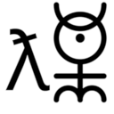

# Contributing 

✨monadica✨



Thank you for considering contributing to **Monadica**! By participating, you’re joining a community dedicated to building technology that empowers, connects, and uplifts everyone. Monadica values responsible stewardship, transparency, equality, and social good — and we’re excited to work together to make a positive impact.

---

## How You Can Help 🛠️

There are many ways to get involved with Monadica! Here’s how you can contribute:

### 1. Report Issues 🐞
Found a bug or a vulnerability? Reporting issues is a great way to help us improve. To report an issue:

- **Check for Duplicates**: Before reporting, search the [existing issues](https://github.com/monadica/monadica/issues) to see if it has already been raised.
- **Provide Details**: Give a clear, concise description of the issue, steps to reproduce, and any relevant environment information.
- **Label Appropriately**: Use labels like “bug,” “enhancement,” or “documentation” to help us categorize issues effectively.

### 2. Suggest Features 🚀
We’re always looking for new ideas to make Monadica better!

- **Explain the Value**: Describe the feature, its purpose, and how it aligns with Monadica’s mission.
- **Discuss Feasibility**: Mention any potential challenges or dependencies.
- **Be Open to Feedback**: Feature discussions are collaborative, so feedback and refinement are encouraged!

### 3. Improve Documentation 📚
Documentation is essential for making Monadica accessible to everyone. Contributions here can include:

- **Clarifying Instructions**: Simplify complex explanations or expand on any unclear areas.
- **Adding Examples**: Examples are always helpful, especially for new users.
- **Translations**: Help us make Monadica accessible to non-English speakers by adding translations!

### 4. Contribute Code 💻
If you’re ready to dive into the code, we’d love your help! Here’s how:

- **Find a Good First Issue**: Look for [issues labeled “good first issue”](https://github.com/monadica/monadica/issues?q=is%3Aissue+is%3Aopen+label%3A%22good+first+issue%22) to get started.
- **Fork the Repository**: Fork the repository, clone it locally, and create a new branch.
- **Write Clean, Documented Code**: Follow our coding style, document your code, and test thoroughly.
- **Submit a Pull Request**: When your code is ready, submit a pull request (PR). Include a clear summary and reference any related issues.

### 5. Join the Discussion 💬
Participate in conversations, attend virtual meetups, and join us on our [community forums](https://github.com/monadica/monadica/discussions). Everyone’s voice matters!

---

## Our Standards ✨

Monadica holds high standards for contributions, both technically and ethically. Please review these expectations to ensure your contribution aligns with our values:

- **Inclusive Language**: Use welcoming and inclusive language.
- **Respect and Kindness**: Treat everyone with respect and approach discussions with kindness.
- **Transparency**: Be clear about what changes you’re making, why, and any potential risks or limitations.

## Code of Conduct 🤝

All contributors must adhere to the Monadica [Code of Conduct](https://github.com/monadica/monadica/blob/main/CODE_OF_CONDUCT.md). We are committed to providing a welcoming environment for everyone, and we have zero tolerance for harassment, discrimination, or inappropriate behavior.

---

## Getting Started 🏁

Here’s a step-by-step guide to get you up and running:

1. **Fork the Repository**: Go to the Monadica repository and fork it to your GitHub account.
2. **Clone Your Fork**: Clone your fork locally and set up the main repository as an upstream remote:
   ```bash
   git clone https://github.com/YOUR_USERNAME/monadica.git
   cd monadica
   git remote add upstream https://github.com/monadica/monadica.git
