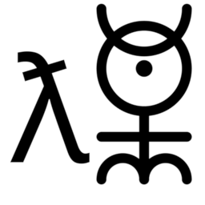

# ✨monadica✨

 
 
 

Welcome to **Monadica**! 🎉 We’re building a future where open source powers positive change for all of humanity. Monadica is dedicated to responsible stewardship in code, ecosystem, and humanity — and we’re thrilled to invite you to join us on this journey.

### 🌍 [monadica.com](https://monadica.com)

---

### About Monadica 🛠️

Monadica is an open-source organization supported by Monadica LLC, an IT and open-source consulting company with a vision of a world where technology is accessible, ethical, and transformative. We’re committed to creating **free and powerful tools** that empower individuals and organizations for the betterment of society.

Our projects range from innovative software solutions to collaborative community efforts, all united under a shared purpose: **to build tools and technologies that serve the social good and foster a better future for all**.

### Mission and Values 💡

- **Openness & Accessibility**: All Monadica projects are **MIT-licensed**, ensuring accessibility for individuals, communities, and organizations around the world.
- **Responsible Stewardship**: We aim to be responsible stewards in code, ecosystems, and humanity. This means caring for the sustainability, security, and transparency of our projects.
- **Equality & Social Good**: We prioritize initiatives that drive social impact, support equality, and provide opportunities for underrepresented communities.
- **Empowering Future Generations**: Through technology, we strive to build a brighter, more connected future for everyone. From beginners to advanced developers, Monadica is a place to learn, share, and grow.

### What We’re Building 🛠️

Monadica is dedicated to creating impactful, open-source tools, libraries, and frameworks for developers and communities. Our projects emphasize:

- **Innovation and Accessibility**: Projects are crafted to be user-friendly, modular, and adaptable.
- **Transparency and Trust**: With clear documentation and open governance, Monadica aims to set a high standard for integrity and transparency.
- **Sustainability and Impact**: Each project is designed with a long-term vision, focusing on sustainable contributions that truly benefit the global community.

### Getting Involved 🙌

We welcome contributions from all corners of the world! Here are some ways to get involved:

1. **Join the Conversation**: Join the discussion in our [GitHub Issues](https://github.com/monadicarts/monadicarts/issues).
2. **Contribute Code**: Fork a repository, work on a bug, or implement a feature. Make sure to check out our [contributing guidelines](CONTRIBUTING.md) to get started.
3. **Spread the Word**: If you like what we're building, share it! Monadica thrives with community support, and every bit helps.
4. **Support Our Mission**: Monadica LLC is the primary backer of our projects, but we rely on community involvement to succeed. If you’d like to support us financially, please check out our [sponsorship options](https://github.com/sponsors/monadicarts).

### License and Code of Conduct 📜

- **License**: Monadica projects are licensed under the [MIT License](https://opensource.org/licenses/MIT), ensuring open access and freedom to use, modify, and distribute.
- **Code of Conduct**: We have a [Code of Conduct](CODE_OF_CONDUCT.md) to foster an inclusive, respectful, and positive environment. By contributing to Monadica, you agree to uphold these values.

### Transparency and Partnership with Monadica LLC 💼

Monadica is proudly supported by **Monadica LLC**, an Open Source and IT Consulting company. Monadica LLC serves as both a key contributor and responsible backer, ensuring that our projects receive the support, resources, and sustainable funding needed to thrive. Together, Monadica LLC and the Monadica open source community work to uphold our vision of **ethical, accessible, and impactful technology**.

---

### Join Us on Our Mission 🌱

Our commitment is to humanity, technology, and the future. Monadica exists for **responsible humanism, social good, and equality**, and we believe everyone has a role to play. Whether you’re contributing code, sharing ideas, or supporting us in spirit — you’re helping build a brighter, more open world.

Let’s change the world together. **Welcome to Monadica.** 🧑‍💻🌎💡

---

Made with ❤️ by the <a href="https://monadica.com">Monadica</a> community and Monadica LLC.

